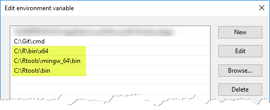
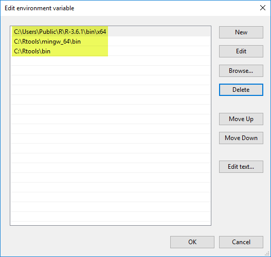
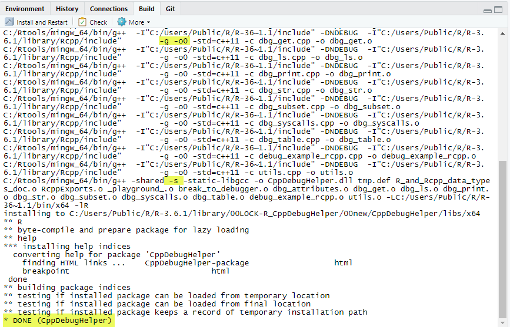

```{r setup, include = FALSE}
knitr::opts_chunk$set(
  collapse = TRUE,
  comment = "#>"
)
```

# Motivation

The [R for Windows FAQ says](https://cran.r-project.org/bin/windows/base/rw-FAQ.html#How-do-I-debug-code-that-I-have-compiled-and-dyn_002eload_002ded_003f) that debugging compiled C/C++ code under Windows

> is often a fraught process and sometimes does not work at all.

The **main problem under Windows** is the lack of a simple, universal and reliable way to interrupt ("break") R into the debugger like eg. Linux offers (by pressing CTRL + C).

The above mentioned *R for Windows FAQ* gives just a short (but very helpful) introduction on how to debug under Windows.

This vignette compares the options you have and gives step-by-step instructions on how to debug C/C++ code contained in an R package line-by-line.

To make debugging easier the step-by-step instructions use this package eg. to print R variable values without having to care about R ([SEXP](https://cran.r-project.org/doc/manuals/r-release/R-ints.html#SEXPs)) or `Rcpp` data types.

**Note:** Debugging is not restricted to C/C++ code in packages but to simplify the explanations here the other variations
are not explicity explained since they can be debugged similar:

- directly sourced C++ code via the [`Rcpp`](https://github.com/RcppCore/Rcpp) package)
- shared libraries (DLLs) that are dynamically loaded into R eg. via `dyn.load`


# Required installations

## R infrastructure

To be able to debug C/C++ code contained in a package you have to install

| Software                                                                     | Required for                                                                                                                                                                                  |
|------------------------------------------------------------------------------|-----------------------------------------------------------------------------------------------------------------------------------------------------------------------------------------------|
| [R for Windows](https://cran.r-project.org/bin/windows/)                                                                | Windows binaries for the R base distribution                                                                                                                                                  |
| [Rtools](https://cran.r-project.org/bin/windows/Rtools/)                                                                       | Contains the `gdb` debugger and C/C++ compiler (required to compile the C/C++ code with debugging symbols)                                                                                    |
| [(R source code)](https://cran.r-project.org/)                                                              | Optional: If you want to debug R itself or set breakpoints into R functions by name you have to recompile R on Windows (not recommended - takes a lot of time for setup and solving problems) |
| ([RStudio Desktop](https://rstudio.com/products/rstudio/download/#download)) | Optional (but recommended for easier dev workflows): Used as IDE for R and C/C++ code, building packages. The debugger `gdb` can be run directly in the RStudio console                       |

You can find the downloads at the [official web site of R](https://cran.r-project.org/).


## Edit path environment variable

In Windows go to the *Control Panel > Edit environment variables for your account* and make sure
R and Rtools are added at least to the search path so that you can work in the Windows console easily:




You can also see the path settings in R via `Sys.getenv("PATH")`.


## Required R packages

Install the following packages:

| Package                      | Required for                                                                               | Installation                                      |
|------------------------------|--------------------------------------------------------------------------------------------|---------------------------------------------------|
| devtools                     | install packages from github                                                               | install.packages("devtools")                      |
| usethis                      | makes finding and editing R configuration files easy                                       | install.packages("usethis")                       |
| *the package to be debugged* | This does also install all dependencies (other required packages)                          | install.packages("*package_name*")                |
| CppDebugHelper               | This package makes it easy to inspect variable values and structures in the `gdb` debugger | devtools::install_github("aryoda/CppDebugHelper") |


# Prepare the package for debugging (recompile with debugging symbols)

To be able to debug the C/C++ code of a package line-by-line the debugging symbols
must be included and the code optimization must be turned off (otherwise the debugger
may get confused and shows the wrong source code line).


## Change the `make` configurations of R

**This is a critical part since some obscure problems may occur that prevent the creation
of debugging symbols.**

To enable debugging symbols try each of the following changes in this order, save the changed configuration, recompile (build the package - see the next section) - until it works:

1. Modify the `Makevars` file via `usethis::usethis::edit_r_makevars()` in RStudio and add this line:

   `CXXFLAGS = -g3 -o0`
   
   If this `make` variable is already set disable the line by putting a `#` in the first column
   and add the line above. Save the file and recompile (*Build > Clean and Rebuild*).
     
   **Important: Don't forget to remove or comment the line later or you may slow down your R or newly installed packages!**
   
1. If modifying the `Makevars` file of the user (not of the package project = not in the `src` sub folder)
   does not work to compile with debugging symbols:
   
   Modify the first lines in the `Makeconf` file in the `etc\x64` folder of your R installation (eg. in `C:\R\etc\x64\Makeconf`) like this (after making a backup):

   ```
   DEBUG = T   # add this line to enable debugging symbols globally

   ifdef DEBUG
     DLLFLAGS=
   #  DEBUGFLAG=-gdwarf-2    # comment this line to replace it with the next line
     DEBUGFLAG=-g -o0        # add this line
   else
     DLLFLAGS=-s
     DEBUGFLAG=
   endif
   ... (omitted) ...
   ```
   
   **Via this HACK you do not have to reconfigure the R make config (which would require a working
   tools stack and installing the R source code too).**
   
   **Important: Do not forget to undo these changes later or you may slow down your R or newly installed packages!**


1. If modifying the `Makevars` and `Makeconf` files did not succeed in compiling debugging symbols
   the `SystemRequirements:` line in the package's `DESCRIPTION` file may be the problem
   (for unknown reasons). Remove this line from the `DESCRIPTION` file and add the required C++ version to
   
   (eg. `SystemRequirements: C++11` in `DESCRIPTION`)
   
   `CXXFLAGS = -g3 -o0 -std=c++11` in the `Makevars` file
   
   or
   
   `DEBUGFLAG=-g -o0 -std=c++11` in the `Makeconf` file.


## Rebuild the package and check for debugging symbols

To rebuild the package use RStudio: (*Build > Clean and Rebuild*)

**Important: You must rebuild completely since changing the `make` config files does not trigger a full rebuild!**

The build must succeed.

Make sure the created code contains debugging symbols by checking the `Build` tab in RStudio:



- All `g++` command must contain the `-g -O2` switch (and no other `-g*` or `-O*` switches after (right-hand side)
  these switches (since the last switch is the winner ;-)
  
- The call to the linker (one of the last lines) does **NOT** contain a `-s` switch since this would filter out ("strip")
  the debugging symbols again during linking.
  You can recognize the linker call by a line like this: `... Rtools/mingw_64/bin/g++ -shared -static-libgcc ...`


# Overview over debugging options

You basically have three options to debug C/Cpp code in R on Windows.

Each option has different advantages and disadvantages regarding

- how easy it is to start debugging
- how easy it is to break into the debugger
- the output of gdb and R (same vs. separate windows): 

| R console | Command line  | break to debugger*                                                | Output                                                  | Notes                                                                                                                                                                           |
|-----------|---------------|---------------------------------------------------------------------|---------------------------------------------------------|---------------------------------------------------------------------------------------------------------------------------------------------------------------------------------|
| RGui      | `gdb RGui.exe`  | no Ctrl + c (but menu item for software breakpoint in *Misc*)       | separate output for R and gdb (2 different windows)     | Turn off buffering in *Misc* menu to avoid [delayed output to Rconsole](https://cran.r-project.org/bin/windows/base/rw-FAQ.html#The-output-to-the-console-seems-to-be-delayed) |
| RScript   | `gdb RScript`   | no Ctrl + c (but software breakpoint with opcode 0xCC works)        | same output terminal for R and gdb (same terminal)      |                                                                                                                                                                                 |
| R         | `gdb --pid=123` | Ctrl + c works (and software breakpoint with opcode 0xCC works too) | separate output for R and gdb (two different terminals) | Use `Sys.getpid()` in R to the the PID                                                                                                                                          |

*) On x86 (32 bit) and amd64/x86_64 (64 bit) architectures a software breakpoint to an attached debugger can be triggered
by the machine opcode `0xCC` (INT 3) which calls the interrupt 3 (signal "SIGINT").


# TODO Explain each option with step-by-step instructions...

## Debugging with RGui

## Debugging with RScript

## Debugging with R


# References

[R for Windows FAQ > How do I debug code that I have compiled and dyn.load-ed?](https://cran.r-project.org/bin/windows/base/rw-FAQ.html#How-do-I-debug-code-that-I-have-compiled-and-dyn_002eload_002ded_003f)

[R FAQ](https://cran.r-project.org/doc/FAQ/R-FAQ.html)

[R Installation and Administration](https://cran.r-project.org/doc/manuals/R-admin.html)

[Building R for Windows](https://cran.r-project.org/bin/windows/Rtools/)

[R Internals](https://cran.r-project.org/doc/manuals/r-release/R-ints.html)

[Documentation of the GNU make utility & Makefile syntax](https://www.gnu.org/software/make/manual/make.html)

[Internals about R's SEXP data type](https://cran.r-project.org/doc/manuals/r-release/R-ints.html#SEXPs)
